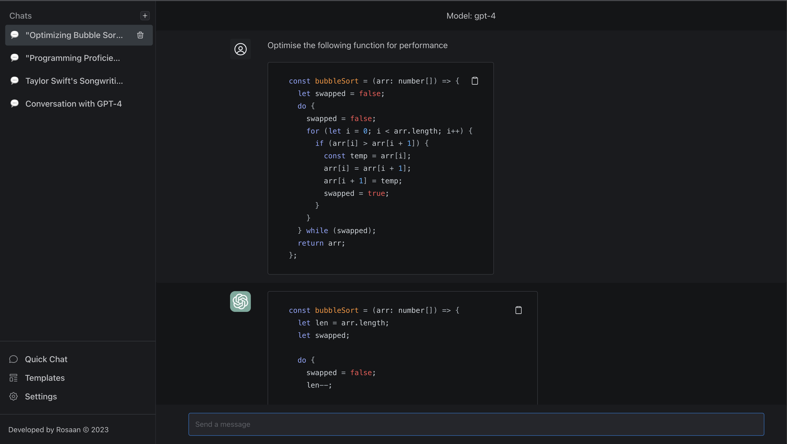

# ChatGPT Personal Assistant

ChatGPT Personal Assistant is a user-friendly interface for OpenAI's GPT-powered model, allowing users to harness the power of GPT as their very own personal assistant. This project enables users to input their own API key and interact with the GPT model conveniently and efficiently.



## Features

- Simple and intuitive graphical user interface
- User-customizable settings for GPT model
- Real-time interaction with GPT
- Docker support for easy deployment

## Installation

### Using Docker

1. Install [Docker](https://docs.docker.com/get-docker/) on your system.

2. Pull the ChatGPT Personal Assistant Docker image from the Docker registry:

```bash
docker pull rosaan/chatgpt-personal-assistant:latest
```

3. Run the Docker container:

```bash
docker run -d -p 8080:3000 --name chatgpt-personal-assistant -v chatgpt-personal-assistant-db:/app/data/db.sqlite rosaan/chatgpt-personal-assistant:latest
```

4. Access the ChatGPT Personal Assistant UI in your web browser by navigating to `http://localhost:8080`.

### Manual Installation

1. Install [Git](https://git-scm.com/book/en/v2/Getting-Started-Installing-Git) on your system.

2. Clone the ChatGPT Personal Assistant repository:

```bash
git clone https://github.com/rosaan/chatgpt-personal-assistant.git
```

3. Change to the cloned directory:

```bash
cd chatgpt-personal-assistant
```

4. Build and run the Docker container using the provided Dockerfile:

```bash
docker build -t chatgpt-personal-assistant .
```

```bash
docker run -d -p 8080:8080 --name chatgpt-personal-assistant chatgpt-personal-assistant --volume $(pwd)/data/db.sqlite:/app/data/db.sqlite
```

or

```bash
docker-compose up -d
```

5. Access the ChatGPT Personal Assistant UI in your web browser by navigating to `http://localhost:8080`.

## Usage

1. Input your API key by clicking on the "Settings" icon and entering your OpenAI API key in the designated field.

2. Type your query or request into the input field and press "Enter" button to interact with your GPT personal assistant.

3. Enjoy your personalized AI experience!

## Contributing

We welcome contributions to the ChatGPT Personal Assistant project. Please feel free to open issues or submit pull requests for any bugs, improvements, or new features.

## License

This project is licensed under the MIT License. See [LICENSE](LICENSE) for more details.
